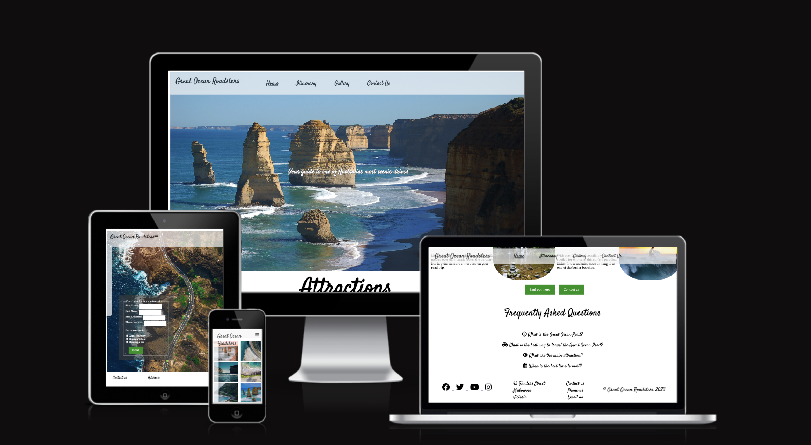
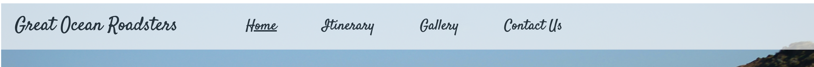
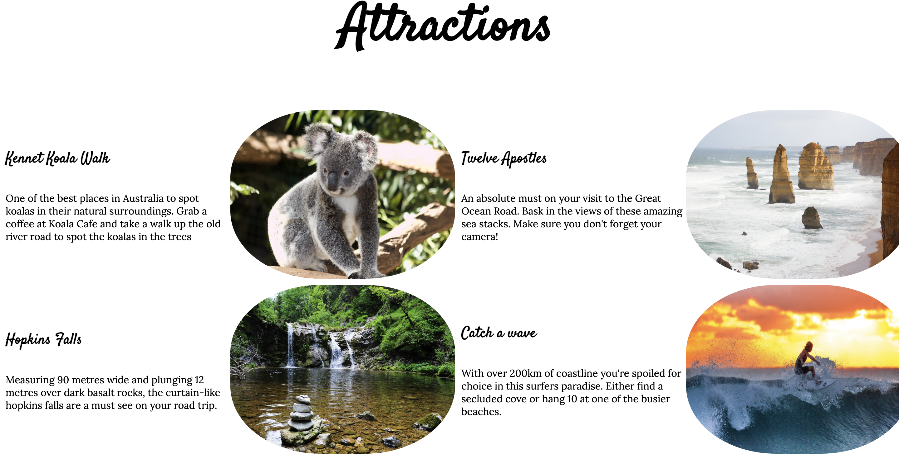
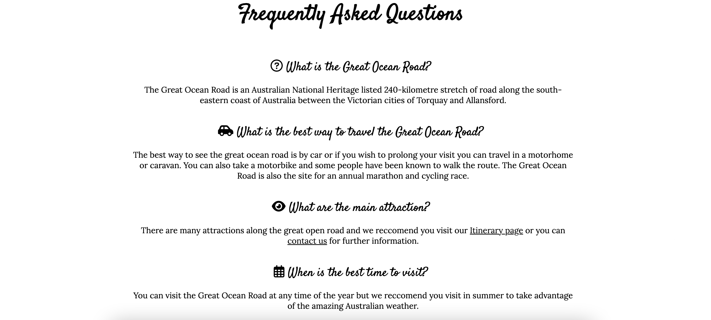
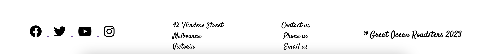
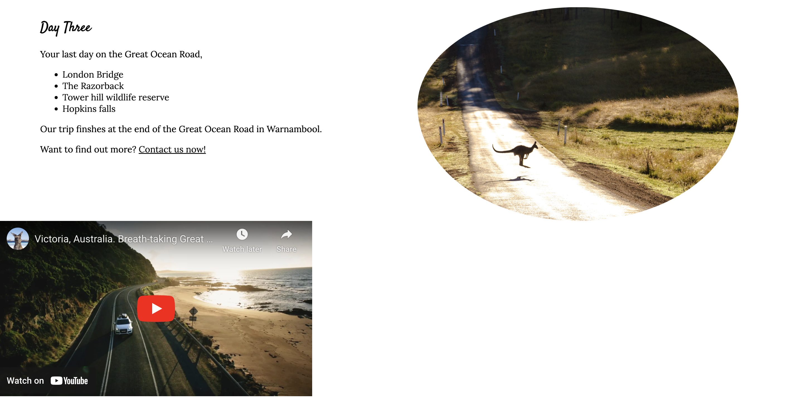
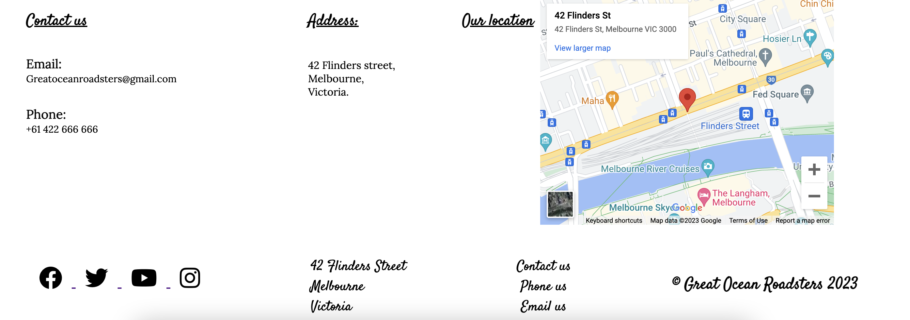

# Great Ocean Roadsters

<!-- In this section, you will include one or two paragraphs providing an overview of your project. Essentially, this part is your sales pitch. At this stage, you should have a name for your project so use it! Don’t introduce the project as a Portfolio project for the diploma. In this section, describe what the project hopes to accomplish, who it is intended to target and how it will be useful to the target audience. -->
 
#Great Ocean Roadsters

Great Ocean Roadsters is a website designed for travelers by travelers. The site aims to provide useful information for anyone traveling on the Great Ocean Road in Victoria, Australia.  Whether you're backpacking in Australia, on a family holiday or an Aussie getting out to see your own country we provide all the information you need to make the most of your trip. This website will provide a sample three day intinerary with the option to contact us to have the perfect personalised itinerary designed just for you or to help organise a guided tour or car rental. 

## Features 

<!-- In this section, you should go over the different parts of your project, and describe each in a sentence or so. You will need to explain what value each of the features provides for the user, focusing on who this website is for, what it is that they want to achieve and how your project is the best way to help them achieve these things. -->

### Existing Features

- __Navigation Bar__

  - Featured on all three pages, the full responsive navigation bar includes links to the Logo, Home page, Gallery, Itinerary and Contact us page. The nav bar on each pge is the exact same to allow for ease of navigation.
  - This section will allow the user to easily navigate from page to page across all devices without having to revert back to the previous page via the ‘back’ button. 

- __The landing page image__

  - The landing includes a photograph with text overlay to allow the user to know the exact purpose of the website.
  - This section teases the user with a picture of the Twelve apostles geographical feature and the caption "Your guide to one of Australias most scenic drives.

- __Attractions section__

  - The attractions section allows the user to see some of the highlights of the Great Ocean Road and some of the activities or sights they will encounter along the way.  
  - There are two calls to action under the attractions section. One is a 'Find out more' CTA which will link the user to the Itinerary page. The other is a "Contact us" CTA which will link the user to the Contact us page where the user can fill out their details and submit a form to acquire  further information. Both of these buttons will open the page in a new tab to allow the user to return easily to where they had been.

- __Frequently Asked Questions section__

  - This section will allow the user to find the answers to common questions.
  - This section will have icons beside each question.
  - This section will focus on what, where, when and how.
    What is the great ocean road?
    How can I navigate it/What is the best way to travel?>
    What are the main attractions?
    When is the best time to go?
  - The questions will expand with the answer when clicked. This is intuitive behaviour for an FAQ section.
     

- __The Footer__ 

  - The footer is broken into four sections. It contains a copyright section and a link to the social medias (facebook, twitter, instagram, youtube). It also contains the address for the GreatOceanRoadsters office. The footer also contains three links that act as calls to action.
  - The three links in the footer are Contact us, Phone us and Email us. The Contact us link takes the user to the Contact Us page in a new tab. While here the user can fill out a form, access our email and phone number information and view our street address aswell as see the address on a googlemaps link. The phone us link will allow the user to phone GreatOceanRoadsters directly and the Email us link will open a new page to email Great Ocean Roadsters directly.
  - The footer is valuable to the user as it encourages them to keep connected via social media and also to contact us without having to search for our contact information.
  - The footer is the same on all of the webpages to allow for standardisation and ease of use.

- __Itinerary Page__

  - This page will allow the user to view a sample three day itinerary. The page will provide links to the different activities but will not provide too much information. The page will contain links to websites for different activities and also includes a link to our contact page.

  The page also contains an iFrame with an embedded youtube video which displas aerial drone footage of the Great Ocean Road.

- __Gallery__

  - The gallery will provide the user with supporting images to see what the attractions look like. 
  - This section is valuable to the user as they will be able to easily visualise the different tourist attractions along the route and will get the user excited for their trip and make them more likely to contact us for more information.

- __The Contact Us Page__

  - This page has a large hero image along with a sign up form. The sign up form asks for the users basic information and includes a checkbox to allow us to better answer the customers query.   This section also includes contact information such as an email with clickable email link and a phone number that when clicked will allow the user to call directly from their laptop or mobile. The address for the office is also included aswell as an embedded google maps link to allow for easy navigation to our office location in Melbourne.

### Features Left to Implement

- Another feature idea
-->

## Testing 
<!-- 
In this section, you need to convince the assessor that you have conducted enough testing to legitimately believe that the site works well. Essentially, in this part you will want to go over all of your project’s features and ensure that they all work as intended, with the project providing an easy and straightforward way for the users to achieve their goals.

In addition, you should mention in this section how your project looks and works on different browsers and screen sizes.

You should also mention in this section any interesting bugs or problems you discovered during your testing, even if you haven't addressed them yet. -->

 BUGS
  I encountered several bugs while creating this project.

  There were issues with the icons and social media links located in the footer. I struggled to correctly format links to the external sites while creating links in the icons.
  This was corrected by adding "HTTPS://" to the front of the href aswell aswell as adding the target="_blank" attribute.
  I was also having issues with the icons duplicating themselves with one icon having an active link and the second icon not having a link. This was due to an issue with missing closing tags on our <i> element and was quickly corrected after some testing.

  There was an issue when creating the hero image for the landing page. When adding the hero image the nav bar would disappear. This issue was temporarily fixed by removing the 'position:fixed;' attribute. We still wanted the Nav bar to be fixed so we corrected this by setting the z-index to 1.

  The attractions section on the index page caused a lot of issues as this was the first time working with flexbox. The [Academind](https://www.youtube.com/watch?v=RSIclWvNTdQ) youtube tutorial on CSS V Flexbox was very helpful to resolve these issues.

  When uploading the photos for the attractions page I spent a lot of time struggling with the format of one image. I could not figure out why the css was not working on this one image but had formatted all of the other images correctly. In the end I gave up and opted to change the image. When I changed the image to one of a similar theme the image responded to the css immediately. In hindsight I think the issue may be that the original image was in portrait mode and all of the other images were in landscape...

  While creating the hamburger menu I struggled a lot with a certain bug. I was able to format the menu but could not manage to get the menu to open. I struggled with this for a long time until an online blog I was reading suggested moving the script tag to after where the element is declared. I moved the script tag to the bottom of the html page and the hamburger menu began to work without any issues.

  I tried to create a pair of buttons on the index page with class to action of Find Out More and Contact Us. I nested an anchor tag within the button but this did not pass html validation. I searched on [stack overflow](https://stackoverflow.com/questions/6393827/can-i-nest-a-button-element-inside-an-a-using-html5) and found a solution. In the end I opted to keep the a tag and style it with CSS to resemble a button.

  - Once the site was deployed I had issues with viewing the hero images on each page. This was due to the use of absolute file paths. Once we changed them to relative file paths the images loaded without issues.
  
  

### Validator Testing 

- HTML
  - No errors were returned when passing through the official [W3C validator](https://validator.w3.org/nu/?doc=https%3A%2F%2Fcode-institute-org.github.io%2Flove-running-2.0%2Findex.html)
- CSS
  - No errors were found when passing through the official [(Jigsaw) validator](https://jigsaw.w3.org/css-validator/validator?uri=https%3A%2F%2Fvalidator.w3.org%2Fnu%2F%3Fdoc%3Dhttps%253A%252F%252Fcode-institute-org.github.io%252Flove-running-2.0%252Findex.html&profile=css3svg&usermedium=all&warning=1&vextwarning=&lang=en#css)

### Unfixed Bugs

<!-- You will need to mention unfixed bugs and why they were not fixed. This section should include shortcomings of the frameworks or technologies used. Although time can be a big variable to consider, paucity of time and difficulty understanding implementation is not a valid reason to leave bugs unfixed. 

-->

## Deployment

This section should describe the process you went through to deploy the project to a hosting platform (e.g. GitHub) 

- The site was deployed to GitHub pages. The steps to deploy are as follows: 
  - In the GitHub repository, navigate to the Settings tab 
  - From the source section drop-down menu, select the Master Branch
  - Once the master branch has been selected, the page will be automatically refreshed with a detailed ribbon display to indicate the successful deployment. 

The live link can be found here - https://d-lynch95.github.io/Portfolio-1-GreatOceanRoadsters/

## Credits 

### Content 

- The following websites were used to source information on the different attractions : 

  - https://www.visitmelbourne.com/
  -  https://visitgreatoceanroad.org.au/
  -  https://visitapollobay.com/
  -  https://visit12apostles.com.au/
  -  https://www.greatoceanroadaustralia.org/
  -  https://greatoceanroadmelbournetours.com.au/
  -  https://www.parks.vic.gov.au/

- The format and template for the README file was borrowed from the [Code institute](https://codeinstitute.net/ie/)

- The icons in the footer were taken from [Font Awesome](https://fontawesome.com/)

- The hero image and images for the different attractions were taken from [Pexels](https://www.pexels.com)

- The text for the FAQ section on the index page was taken from Wikipedia.

- The ideas for the footer came from [Colibri](https://colibriwp.com/blog/website-footers/)

### Media

- The hero image and the images for the itinerary page were taken from [Pexels](https://pexels.com)

- The favicon was sourced from [Favicon.io] (https://favicon.io/favicon-generator/)

- The youtube iframe footage was taken from [Oleg Smirnov](https://www.youtube.com/watch?v=9OcBGr5-yRE)

- The photos for the gallery were all taken from [Unsplash](https://unsplash.com/s/photos/great-ocean-road)

### Coding help

- The outline template for the HTML body was provided by the [Code Institiute](https://www.codeinstitute.com)

- Formatting for the hero image was sourced from https://dzuz14.medium.com/code-a-full-width-hero-background-image-with-transparent-overlay-95d757f8ff2c

- Attaching the email link on contact us page was sourced from [Indeed](https://www.indeed.com/career-advice/career-development/how-to-make-email-link-in-html)

- The link to calling a phone number on the contact us page was sourced from https://www.gaintap.com/archives/clickable-website-phone-number-and-call-tracking-guide/.

- The map for the contact us was created using the map creator function on [Maps.ie] (https://www.maps.ie and they also provided the hmtl code). When using HTML w3c validator this content raised a lot of issues with outdated html.

- Insteas the iframe is now embedded directly on the website following advice from [Google support](https://support.google.com/maps/answer/144361?hl=en&co=GENIE.Platform%3DDesktop#:~:text=Embed%20a%20map%20or%20directions&text=Click%20Share%20or%20embed%20map,Click%20Embed%20map.&text=Copy%20the%20text%20in%20the,of%20your%20website%20or%20blog.)

- The font was inspired by the logo of https://visitgreatoceanroad.org.au/ . We then located a similar font on google fonts, paired it with another font using Fontjoy and imported them from there.

- Styling of the attractions images was sourced from [w3schools] (https://www.w3schools.com/css/css3_images.asp)

- The code for the hamburger menu was taken from [this webpage] (https://dev.to/devggaurav/let-s-build-a-responsive-navbar-and-hamburger-menu-using-html-css-and-javascript-4gci)

- The bug related to the hamburger menu was solved using help from [this blog] (https://codingbeautydev.com/blog/javascript-cannot-read-property-addeventlistener-of-null/#:~:text=November%2014%2C%202022-,The%20%E2%80%9Ccannot%20read%20property%20'addEventListener'%20of%20null%E2%80%9D%20error,element%20absent%20from%20the%20DOM)

- Changing the icons for the FAQ section was done with help from [Stack overflow] (https://stackoverflow.com/questions/10813581/can-i-replace-the-expand-icon-of-the-details-element)

- Adding the Favicon to the website was done using help from [StackOverflow](https://stackoverflow.com/questions/4888377/how-to-add-a-browser-tab-icon-favicon-for-a-website)

- The accesability advice for the hamburger menu came from [UXdesign] (https://uxdesign.cc/create-an-accessible-hamburger-menu-869b0301cfd7)

- The styling for the CTA anchor tags on the index page was taken from [FreeCodeCamp](https://www.freecodecamp.org/news/html-button-link-code-examples-how-to-make-html-hyperlinks-using-the-href-attribute-on-tags/)

- The aria-label for the nav menu was formatted using information from [Acede-web](https://www.accede-web.com/en/guidelines/rich-interface-components/hamburger-menu/)

<!--
## Other General Project Advice

Below you will find a couple of extra tips that may be helpful when completing your project. Remember that each of these projects will become part of your final portfolio so it’s important to allow enough time to showcase your best work! 

- One of the most basic elements of keeping a healthy commit history is with the commit message. When getting started with your project, read through [this article](https://chris.beams.io/posts/git-commit/) by Chris Beams on How to Write  a Git Commit Message 
  - Make sure to keep the messages in the imperative mood 

- When naming the files in your project directory, make sure to consider meaningful naming of files, point to specific names and sections of content.
  - For example, instead of naming an image used ‘image1.png’ consider naming it ‘landing_page_img.png’. This will ensure that there are clear file paths kept. 

- Do some extra research on good and bad coding practices, there are a handful of useful articles to read, consider reviewing the following list when getting started:
  - [Writing Your Best Code](https://learn.shayhowe.com/html-css/writing-your-best-code/)
  - [HTML & CSS Coding Best Practices](https://medium.com/@inceptiondj.info/html-css-coding-best-practice-fadb9870a00f)
  - [Google HTML/CSS Style Guide](https://google.github.io/styleguide/htmlcssguide.html#General)

Getting started with your Portfolio Projects can be daunting, planning your project can make it a lot easier to tackle, take small steps to reach the final outcome and enjoy the process! 
-->