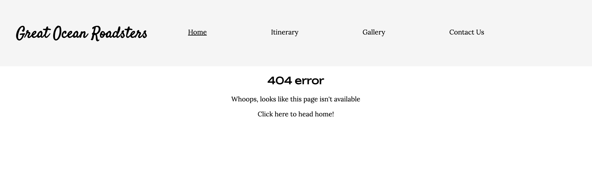

# Great Ocean Roadsters

Great Ocean Roadsters is a website designed for travelers by travelers. The site aims to provide useful information for anyone traveling on the Great Ocean Road in Victoria, Australia.  Whether you're backpacking in Australia, on a family holiday or an Aussie getting out to see your own country we provide all the information you need to make the most of your trip. This website will provide a sample three day intinerary with the option to contact us to have the perfect personalised itinerary designed just for you or to help organise a guided tour or car rental. 

[Live Website](https://d-lynch95.github.io/Portfolio-1-GreatOceanRoadsters/index.html)

## User Goals and Stories

### User goals
- As a user I want to
  - learn more about the great ocean road.
  - easily and intuitively navigate throughout the website
  - browse the website naturally and return home with ease
  - easily access the navigation menu at any time
  - be able to view the website and read all information on all screen sizes
  - view clear images throughout the site especially of the main attractions
  - be able to reach out to the company for more information

### Business owner goals
- As the website business owner I want to 
  - deliver clear information about the great ocean road
  - provide amazing photos to excite the website user
  - provide enough information to entice the customer to look for more information
  - make it easy for customers to reach out to the business

### User Stories

#### As a user
  - As a user I want to learn more about the great ocean road
  - As a user I want to see photos of the main sights
  - As a user I want to learn more about the attractions
  - As a user I want to view a sample itinerary
  - As a user I want to find contact information for the company
  - As a user I want to use their services to plan my trip
  - As a user I want to follow the company on social media 

#### As a website business owner
- As a site owner I want to allow users to visually experience the great ocean road
- As a site owner I want to excite users and peak their interest
- As a site owner I want to provide some information so the customer reaches out for more
- As a site owner I want to allow for a good user experience
- As a site owner I want to grow my audience on social media in hopes of converting them to customers
- As a site owner I want to provide contact information if the user wants to reach out
- As a site owner I want to provide a contact form to allow customers to contact us
- As a site owner I want to collect potential leads and cross-sells through the contact form
- As a site owner I want to allow the customer to easily navigate the website without issues
- As a site owner I want to provide an error 404 page with a link home incase of any issues

#### As a new user
- As a new user I want to learn what the great ocean road is
- As a new user I want to have my basic questions answered
- As a new user I want to see photos of the great ocean road
- As a new user I want to know what I can do there
- As a new user I want to know how I can find out more information
- As a new user I want to navigate the page intuitively and with ease
- As a new user I want to view the company's social media to learn more about them
- As a new user I want to see the physical address of the company if I want to visit in person
- As a new user I want to find contact information for the company
- As a new user I want to know what other services the company provides

## Design

### Font
The design of this website was based off a very minimalist natural style. We wanted the photos to do most of the heavy lifting so we've opted to go with very visually striking hero images with strong colours of blue, green and yellow. In order to allow the photos to stand out we've gone for a minimalist white background with black text so as to not distract from the photos. 

We wanted a bohemian style logo for the website so we opted to use the 'Satisfy' font from Google fonts. We noticed that this font did not work well for the other headers so we changed the font to 'Unbounded' for the rest of the text and we found this font worked very well for the theme we were going for. Using Google font pairings we opted to use 'Lora' for the main body

### Structure

We went for a simple four page website with a confirmation page following form submission and an error 404 page with a link back to the homepage. We found this format was easiest to allow users to navigate the website and achieve their user goals without the website becoming too complicated or clutered.

### Wireframe

The site has developed a lot since the original wireframes were created. The original wirerames were not created in a mobile first environment and instead reflect a desktop site. This was an interesting learning experience during this project. In future we will develop websites in a mobile first environment.

##### Index Page

#### Itinerary page

#### Contact us page

## Technologies used
- HTML
  - The main body of the website was created using HTML
- CSS
  - The website was styled using a linked CSS file
- GitHub
  - The website is hosted on GitHub
- GitPod
  - The website was developed on GitPod
- Git 
  - used to commit and push code during development
- FontAwesome
  - Icons used for social media links and FAQ icons were obtained from [here](https://fontawesome.com/)
- Convertio.co
  - [This](https://convertio.co/) site was used to convert jpg and png files to webp files
- Tinypng
  - [TinyPNG](https://tinypng.com/) was used to reduce file sizes across the site
- Favicon.io 
  - This site was used to create the [favicon](https://favicon.io/) files
- Balsamiq
  - The original wireframe idea was created using [Balsamiq](https://balsamiq.com/wireframes/desktop/#)

## Features 

### Existing Features

- __Navigation Bar__

  - Featured on all three pages, the full responsive navigation bar includes links to the Logo, Home page, Gallery, Itinerary and Contact us page. The nav bar on each page is the exact same to allow for ease of navigation.
  - This section will allow the user to easily navigate from page to page across all devices without having to revert back to the previous page via the ‘back’ button. 

- __The landing page image__

  - The landing includes a photograph with text overlay to allow the user to know the exact purpose of the website.
  - This section teases the user with a picture of the Twelve apostles geographical feature and the caption "Your guide to one of Australias most scenic drives.

- __Attractions section__

  - The attractions section allows the user to see some of the highlights of the Great Ocean Road and some of the activities or sights they will encounter along the way.  
  - There are two calls to action under the attractions section. One is a 'Find out more' CTA which will link the user to the Itinerary page. The other is a "Contact us" CTA which will link the user to the Contact us page where the user can fill out their details and submit a form to acquire  further information. Both of these buttons will open the page in a new tab to allow the user to return easily to where they had been.

- __Frequently Asked Questions section__

  - This section will allow the user to find the answers to common questions.
  - This section will have icons beside each question.
  - This section will focus on what, where, when and how.
    What is the great ocean road?
    How can I navigate it/What is the best way to travel?
    What are the main attractions?
    When is the best time to go?
  - The questions will expand with the answer when clicked. This is intuitive behaviour for an FAQ section.
     

- __The Footer__ 

  - The footer is broken into two sections. It contains a address section and a link to the social medias (facebook, twitter, instagram, youtube). 
  - The footer is valuable to the user as it encourages them to keep connected via social media and also to find our physical address without having to search for our contact information.
  - The footer is the same on all of the webpages to allow for standardisation and ease of use.

- __Itinerary Page__

  - This page will allow the user to view a sample three day itinerary. The page will provide links to the different activities but will not provide too much information. The page will contain links to websites for different activities and also includes a link to our contact page.

  -The page also contains an iFrame with an embedded youtube video which displays lonely planet footage of the Great Ocean Road.

- __Gallery__

  - The gallery will provide the user with supporting images to see what the attractions look like. 
  - This section is valuable to the user as they will be able to easily visualise the different tourist attractions along the route and will get the user excited for their trip and make them more likely to contact us for more information.

- __The Contact Us Page__

  - This page has a large hero image along with a sign up form. The sign up form asks for the users basic information and includes a checkbox to allow us to better answer the customers query.   This section also includes contact information such as an email with clickable email link and a phone number that when clicked will allow the user to call directly from their laptop or mobile. The address for the office is also included aswell as an embedded google maps link to allow for easy navigation to our office location in Melbourne.

- __Form submission landing page__ 
  - This page allows the user to know that their form has been submitted and that someone will contact them using the information that they have provided. The user is greeted with a large hero image with the text "We got this one. We'll be in contact soon". This page has a nav bar at the top to allow the user to easily return back to the other web pages.

 

 
 
- __Error 404 Page__
    - This page will help the user navigate back to the home page if there is any typo or broken links in the site. This page will contain the nav bar to help navigate and also a clickable link to return home.

### Features Left to Implement

- I would like to add a hamburger menu for mobile and tablet devices for this site when I have the requisite knowledge.

- I would like to format the server in the future to accept form submissions and allow the site owner to view users form submissions.

## Testing 

### BUGS
 - I encountered several bugs while creating this project.

 - There were issues with the icons and social media links located in the footer. I struggled to correctly format links to the external sites while creating links in the icons.
  This was corrected by adding "HTTPS://" to the front of the href aswell aswell as adding the target="_blank" attribute.
  I was also having issues with the icons duplicating themselves with one icon having an active link and the second icon not having a link. This was due to an issue with missing closing tags on our <i> element and was quickly corrected after some testing.

 - There was an issue when creating the hero image for the landing page. When adding the hero image the nav bar would disappear. This issue was temporarily fixed by removing the 'position:fixed;' attribute. We still wanted the Nav bar to be fixed so we corrected this by setting the z-index to 1.

 - The attractions section on the index page caused a lot of issues as this was the first time working with flexbox. The [Academind](https://www.youtube.com/watch?v=RSIclWvNTdQ) youtube tutorial on CSS V Flexbox was very helpful to resolve these issues.

 - When uploading the photos for the attractions page I spent a lot of time struggling with the format of one image. I could not figure out why the css was not working on this one image but had formatted all of the other images correctly. In the end I gave up and opted to change the image. When I changed the image to one of a similar theme the image responded to the css immediately. In hindsight I think the issue may be that the original image was in portrait mode and all of the other images were in landscape.

 - While creating the hamburger menu I struggled a lot with a certain bug. I was able to format the menu but could not manage to get the menu to open. I struggled with this for a long time until an online blog I was reading suggested moving the script tag to after where the element is declared. I moved the script tag to the bottom of the html page and the hamburger menu began to work. 

 - The hamburger menu was creating an issue that when the site is viewed on mobile or tablet sized screens (< 768px) the hamburger menu appears at the left side of the screen as an opaque rectangular box. When the hamburger menu is clicked this menu slides out from the left to fill the screen. As this functionality was borrowed from an online tutorial I have struggled to fix this bug as I do not have the required Javascript knowledge yet. Instead I opted to remove the hamburger menu in favour of a different style of menu for mobile and tablet devices.

 - I tried to create a pair of buttons on the index page with class to action of Find Out More and Contact Us. I nested an anchor tag within the button but this did not pass html validation. I searched on [stack overflow](https://stackoverflow.com/questions/6393827/can-i-nest-a-button-element-inside-an-a-using-html5) and found a solution. In the end I opted to keep the a tag and style it with CSS to resemble a button.

  - Once the site was deployed I had issues with viewing the hero images on each page. This was due to the use of absolute file paths. Once we changed them to relative file paths the images loaded without issues.

  - There was an issue with the confirmation.html page. This page was supposed to be the destination for form submission. After receiving help from Sean Young on slack I was told that we do not yet have the requisite knowledge to format the server to accept form submissions. I have added a submission confirmation page but do not have the server formatted to accept form submissions.
  
  - The footer has underlines in the spaces between the social media icons. User inc21 on slack pointed out that these could be removed by adding a text-decoration:none to the css. This removed the issues with the underline.
  
### User Testing

The site was tested on chrome, safari and opera browsers on desktop without any issues. The site was tested on desktop, tablet and mobile using chrome developer tools. The actual tablet testing was done on an ipad. The mobile testing was done on an iphone 12 using the safari browser and also tested on android devices OnePlus 7 and OnePlus Nord CE on chrome browsers. The site was also tested on a samsung phone using the opera browser. None of the tablet or mobile devices presented any issues.

### Accesability

- Home page

- Itinerary page

- Gallery page

- Contact Us page

- Confirmation page

### Validator Testing 

- HTML
  - No errors were returned when passing through the official [W3C validator](https://validator.w3.org/nu/?showsource=yes&doc=https%3A%2F%2Fd-lynch95.github.io%2FPortfolio-1-GreatOceanRoadsters%2Findex.html)
- CSS
  - No errors were found when passing through the official [Jigsaw validator](https://jigsaw.w3.org/css-validator/validator?uri=https%3A%2F%2Fd-lynch95.github.io%2FPortfolio-1-GreatOceanRoadsters%2Findex.html&profile=css3svg&usermedium=all&warning=1&vextwarning=&lang=en)

### Manual Testing

#### Functional Testing 

We tested the links in the navigation section of the header for all pages on multiple devices.

| Navigation link  | Page to load  |
| -----------      | -----------   |
| Logo             | index.html    |
| Home             | index.html    |
| Itinerary        | itinerary.html|
| Gallery          | gallery.html  |
| Contact Us       | contact.html  |

All of these links worked as expected and lead to the correct pages.

We tested the two buttons on the index page. The "Find out more" button links to the itinerary.html page in a new tab. This worked without any issues.
The Contact Us button takes us to contactus.html in a new tab. This did not present any issues.

When the FAQ section questions are clicked the answer should appear beneath in a details and summary section. We tested this for all of the questions on multiple browsers on desktop, mobile and tablet. All of the questions present the answers when clicked as expected.

We also tested the social media links at the bottom of the page and they all led to the respective social media sites.

### Unfixed Bugs
 - There are no current bugs that we're aware of.

## Deployment

This section should describe the process you went through to deploy the project to a hosting platform (e.g. GitHub) 

- The site was deployed to GitHub pages. The steps to deploy are as follows: 
  - In the GitHub repository, navigate to the Settings tab 
  - From the source section drop-down menu, select the Master Branch
  - Once the master branch has been selected, the page will be automatically refreshed with a detailed ribbon display to indicate the successful deployment. 

The live link can be found here - https://d-lynch95.github.io/Portfolio-1-GreatOceanRoadsters/

## Credits 

### Content 

- The following websites were used to source information on the different attractions : 

  - https://www.visitmelbourne.com/
  -  https://visitgreatoceanroad.org.au/
  -  https://visitapollobay.com/
  -  https://visit12apostles.com.au/
  -  https://www.greatoceanroadaustralia.org/
  -  https://greatoceanroadmelbournetours.com.au/
  -  https://www.parks.vic.gov.au/

- The format and template for the README file was borrowed from the [Code institute](https://codeinstitute.net/ie/)

- The icons in the footer were taken from [Font Awesome](https://fontawesome.com/)

- The hero image and images for the different attractions were taken from [Pexels](https://www.pexels.com)

- The text for the FAQ section on the index page was taken from Wikipedia.

- The ideas for the footer came from [Colibri](https://colibriwp.com/blog/website-footers/)

- The image conversions from jpg to webp were done with [Convertio](https://convertio.co)

- The image compressions were done using [Tinypng](https://tinypng.com)

### Media

- The hero image and the images for the itinerary page were taken from [Pexels](https://pexels.com)

- The favicon was sourced from [Favicon.io] (https://favicon.io/favicon-generator/)

- The youtube iframe footage was taken from [Oleg Smirnov](https://www.youtube.com/watch?v=9OcBGr5-yRE)

- The photos for the gallery were all taken from [Unsplash](https://unsplash.com/s/photos/great-ocean-road)

### Coding help

- The outline template for the HTML body was provided by the [Code Institiute](https://www.codeinstitute.com)

- Formatting for the hero image was sourced from https://dzuz14.medium.com/code-a-full-width-hero-background-image-with-transparent-overlay-95d757f8ff2c

- Attaching the email link on contact us page was sourced from [Indeed](https://www.indeed.com/career-advice/career-development/how-to-make-email-link-in-html)

- The link to calling a phone number on the contact us page was sourced from https://www.gaintap.com/archives/clickable-website-phone-number-and-call-tracking-guide/.

- The map for the contact us was created using the map creator function on [Maps.ie] (https://www.maps.ie and they also provided the hmtl code). When using HTML w3c validator this content raised a lot of issues with outdated html.

- Insteas the iframe is now embedded directly on the website following advice from [Google support](https://support.google.com/maps/answer/144361?hl=en&co=GENIE.Platform%3DDesktop#:~:text=Embed%20a%20map%20or%20directions&text=Click%20Share%20or%20embed%20map,Click%20Embed%20map.&text=Copy%20the%20text%20in%20the,of%20your%20website%20or%20blog.)

- The font was inspired by the logo of https://visitgreatoceanroad.org.au/ . We then located a similar font on google fonts, paired it with another font using Fontjoy and imported them from there.

- Styling of the attractions images was sourced from [w3schools] (https://www.w3schools.com/css/css3_images.asp)

- The code for the hamburger menu was taken from [this webpage](https://dev.to/devggaurav/let-s-build-a-responsive-navbar-and-hamburger-menu-using-html-css-and-javascript-4gci)

- The bug related to the hamburger menu was solved using help from [this blog] (https://codingbeautydev.com/blog/javascript-cannot-read-property-addeventlistener-of-null/#:~:text=November%2014%2C%202022-,The%20%E2%80%9Ccannot%20read%20property%20'addEventListener'%20of%20null%E2%80%9D%20error,element%20absent%20from%20the%20DOM)

- Changing the icons for the FAQ section was done with help from [Stack overflow] (https://stackoverflow.com/questions/10813581/can-i-replace-the-expand-icon-of-the-details-element)

- Adding the Favicon to the website was done using help from [StackOverflow](https://stackoverflow.com/questions/4888377/how-to-add-a-browser-tab-icon-favicon-for-a-website)

- The accesability advice for the hamburger menu came from [UXdesign] (https://uxdesign.cc/create-an-accessible-hamburger-menu-869b0301cfd7)

- The styling for the CTA anchor tags on the index page was taken from [FreeCodeCamp](https://www.freecodecamp.org/news/html-button-link-code-examples-how-to-make-html-hyperlinks-using-the-href-attribute-on-tags/)

- The aria-label for the nav menu was formatted using information from [Acede-web](https://www.accede-web.com/en/guidelines/rich-interface-components/hamburger-menu/)

 - I received help on the bug related to the form method attribute from 'Sean Young Alumni' on slack.

 - I also received help from the following slack users for minor bugs or style changes inc21, Tatiana Ruffo, Dave T, Jo_ci and I received a lot of help and advice from my mentor Gareth McGirr 

<!--
## Other General Project Advice

Below you will find a couple of extra tips that may be helpful when completing your project. Remember that each of these projects will become part of your final portfolio so it’s important to allow enough time to showcase your best work! 

- One of the most basic elements of keeping a healthy commit history is with the commit message. When getting started with your project, read through [this article](https://chris.beams.io/posts/git-commit/) by Chris Beams on How to Write  a Git Commit Message 
  - Make sure to keep the messages in the imperative mood 

- When naming the files in your project directory, make sure to consider meaningful naming of files, point to specific names and sections of content.
  - For example, instead of naming an image used ‘image1.png’ consider naming it ‘landing_page_img.png’. This will ensure that there are clear file paths kept. 

- Do some extra research on good and bad coding practices, there are a handful of useful articles to read, consider reviewing the following list when getting started:
  - [Writing Your Best Code](https://learn.shayhowe.com/html-css/writing-your-best-code/)
  - [HTML & CSS Coding Best Practices](https://medium.com/@inceptiondj.info/html-css-coding-best-practice-fadb9870a00f)
  - [Google HTML/CSS Style Guide](https://google.github.io/styleguide/htmlcssguide.html#General)

Getting started with your Portfolio Projects can be daunting, planning your project can make it a lot easier to tackle, take small steps to reach the final outcome and enjoy the process! 
-->